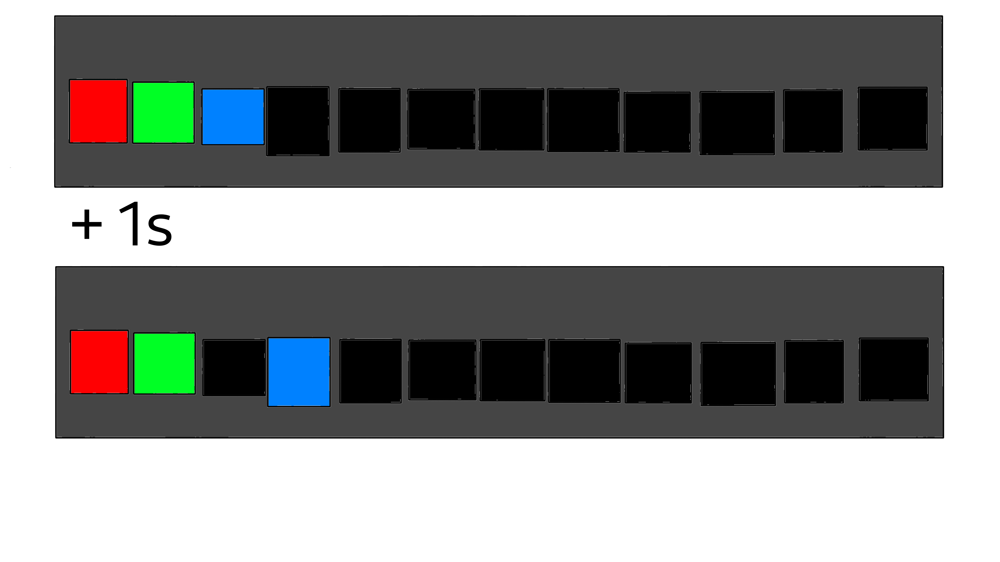
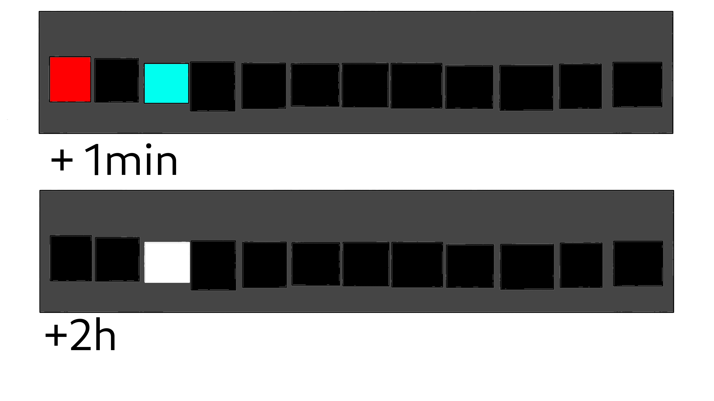
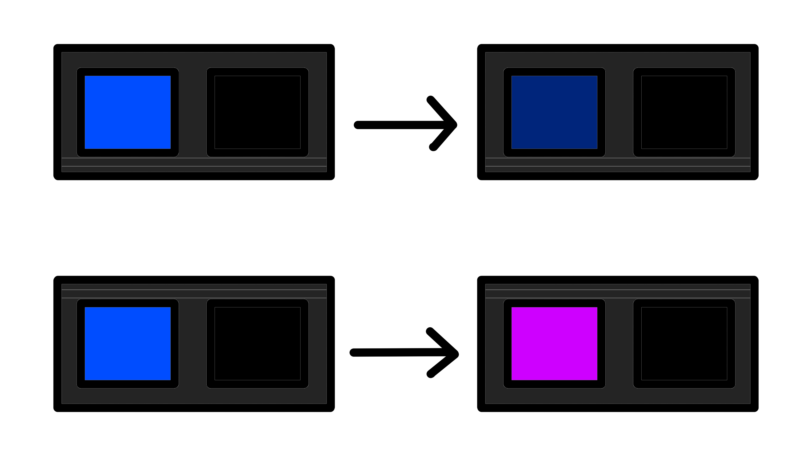
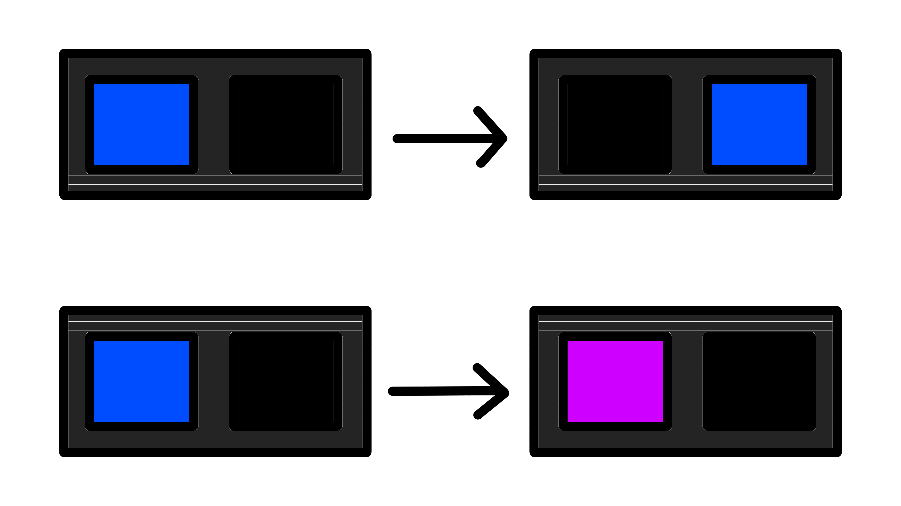

<!--

import: https://raw.githubusercontent.com/liaTemplates/AVR8js/main/README.md

-->

[](https://liascript.github.io/course/?https://raw.githubusercontent.com/Supergecki/ino-clock/main/README.md#1)

# ino-clock
This is a repository for the Arduino lightstrip clock project of the english course for Robotics, Computer Science and Mathematics students at the TU Freiberg.

## Inspiration

### First Idea: Sorting Algorithm


Rejected on grounds of being common

### Second idea: Digits of Pi


Rejected because no use of colours and only used 9 LEDs

### Third Idea: Clock


- practical
- uses all 12 LEDs
- original

                                     {{1}}
*******************************************************************************


\> be us 

\> Brainstorming ideas

\> only basic stuff like sorting algorithm or digits of pi

\> sudden realisation

\> 12 LEDs

\> think of other things with twelve in them

\> calendar

\> clock

\> holyShit.png

\> talk to teammates about clock

\> they immediately wanna do it

This was so obvious why has nobody thought of this before? 

*******************************************************************************

## Goal

* Lights that move from Left to right through the LED strip
* Different coloured lights for hour, minute and second hand
* Two Variations for hours
* Five Variations each for minutes and seconds
* Overlapping hands should add colours





### Questions

                                     {{0-2}}
*******************************************************************************

Different colour or same colour but varying Brightness?

* Different colours clearer
* Same colours easier to understand



                                     {{1}}
$\implies$ Same colours

*******************************************************************************
                                     {{2-4}}
*******************************************************************************

Iterate Variations or LEDs first?

* Variations first for seconds and minutes easier to understand
* LEDs first gives clear AM-PM-indicator


                           {{3}}
$\implies$ Variations first

*******************************************************************************


## Explanation

    {{1}}
*********************************
<h4>include + define</h4>

* import necessary libraries
* set pin + number of LEDs + brightness (constant variables)
* save colour of LEDs in  array

``` cpp
#include "FastLED.h"
#define DATA_PIN 6
#define NUM_LEDS 12
#define BRIGHTNESS 180
```

*********************************

    {{2}}
*********************************
<h4>variables</h4>

* internal timer (in sec)
* speed of timer (normal: 1sec)

what does a clock need?

* hour, minute, second "hand"
* different states for hour/minute/second 1, 2, ...

```
CRGB leds[NUM_LEDS];

unsigned long second_counter = 0;
int speed = 1; // real seconds per internal second

int hours;
int minutes;
int seconds;
int hour_brightness[] = {128, 255};
int min_sec_brightness[] = {51, 102, 153, 204, 255};
```

*********************************

    {{3}}
*********************************
<h4>setup() function</h4>

* connects arduino to LEDs
* sets brightness
  
```
void setup()
{
    FastLED.addLeds<NEOPIXEL, DATA_PIN>(leds, NUM_LEDS);
    FastLED.setBrightness(BRIGHTNESS);

}
```

*********************************

    {{4}}
*********************************
<h4>loop() function</h4>

* waits 1sec / (speed of timer)
* increase timer by 1sec + set colour of LEDs to "black"
* checks if timer > 24h (end of day/clock) --> resets timer
* calculates hour/min/sec with timer --> sets colour for different states
* display on LEDs

```
  
void loop()
{
    delay(1000/speed);
    second_counter++; // increase time by 1
    for (int i = 0; i < NUM_LEDS; i++)
    {
        leds[i] = CRGB(0, 0, 0); // Reset all LEDs to apply the new colors afterwards.
    }
    if (second_counter == 86400)
    {
        second_counter = 0; // Full day is gone, reset timer!
    }

    hours = second_counter / 3600;
    minutes = (second_counter % 3600) / 60;
    seconds = (second_counter % 3600) % 60;

    // Set hour LED.
    leds[hours / 2].red = hour_brightness[hours % 2];

    // Set minutes LED.
    leds[minutes / 5].green = min_sec_brightness[minutes % 5];

    // Set seconds LED.
    leds[seconds / 5].blue = min_sec_brightness[seconds % 5];

    FastLED.show();
}
```
*********************************

### Simulation

<div id="matrix-experiment">
<wokwi-neopixel-matrix pin="6" cols="12" rows="1"></wokwi-neopixel-matrix>
<span id="simulation-time"></span>
</div>

```cpp             Automata
#include "FastLED.h"
#define DATA_PIN 6
#define NUM_LEDS 12
#define BRIGHTNESS 180

CRGB leds[NUM_LEDS];

unsigned long second_counter = 0;
int speed = 1; // real seconds per internal second

int hours;
int minutes;
int seconds;
int hour_brightness[] = {128, 255};
int min_sec_brightness[] = {51, 102, 153, 204, 255};

void setup()
{
    FastLED.addLeds<NEOPIXEL, DATA_PIN>(leds, NUM_LEDS);
    FastLED.setBrightness(BRIGHTNESS);
}

void loop()
{
    delay(1000/speed);
    second_counter++; // increase time by 1
    for (int i = 0; i < NUM_LEDS; i++)
    {
        leds[i] = CRGB(0, 0, 0); // Reset all LEDs to apply the new colors afterwards.
    }
    if (second_counter == 86400)
    {
        second_counter = 0; // Full day is gone, reset timer!
    }

    hours = second_counter / 3600;
    minutes = (second_counter % 3600) / 60;
    seconds = (second_counter % 3600) % 60;

    // Set hour LED.
    leds[hours / 2].red = hour_brightness[hours % 2];

    // Set minutes LED.
    leds[minutes / 5].green = min_sec_brightness[minutes % 5];

    // Set seconds LED.
    leds[seconds / 5].blue = min_sec_brightness[seconds % 5];

    FastLED.show();
}
```
@AVR8js.sketch(matrix-experiment)

## Challenges during development

A non-exhaustive list of challenges we met during development...

### Distinguishable times

    {{1}}
How to make a time representation distinguishable from others?

    {{2}}
The colors we've chosen are not arbitrary!

    {{3}}
- hours are red
- minutes are green
- seconds are blue

    {{3}}
The three color values don't interfere in RGB, which is why they can be added simply!

    {{4}}
$\implies$ This is not a perfect presentation for the human eye, but in theory totally distinguishable.

### LED Refresh

    {{1}}
When trying out the program for the first time, we figured it actually did nothing. Not even a single light flash...!

    {{2}}
Back to the drawing board, we compared our projects to those from earlier years.

    {{3}}
As it seems, the line "FastLED.show()" was missing for us, having the LEDs be set to specific color values but never actually refreshing them!

    {{4}}
Adding the line worked perfectly and solved the problem.

## Future of the project

We still didn't use all potential this project has to offer. Some ideas we had:

### Migrating onto an LED matrix

Having the project run not only on an LED strip but on a matrix (or even a circle of more LEDs) could solve several inconveniences, such as

- We wouldn't have to use brightness to simulate a clock arm position but could use 60 distinct positions right away.
- The point above could fix the problem with distinguishable colors since we could reduce the number of possible shades.
- A graphical matrix or circle LED construction might feel more natural to users.

However, implementing this wasn't possible in the given time and we also lacked the hardware for this.

### Synchronizing with real time

A great dealbreaker for the project: Since Arduino has no integrated RTC (real time clock) module, there is no way to synchronize the program to have it start at the real time, but it always starts at 12 o'clock. This has several downsides:

- The program presents more of a timer than a clock.
- To use it as a clock, you'd have to know when the program started.
- We have no possibility to re-synchronize the clock after the program started, i.e. the clock _might_ tick slower than it should due to internal calculations.

The last point, however, didn't seem to be much of a problem when running the program at normal speed, the deviation was considerably low.

Having a real time clock module at our disposal, the project could have become a _real_ clock.

## Sources

[FastLED library](https://github.com/FastLED/FastLED/wiki/Pixel-reference#chsv)

[Examples](https://github.com/TUBAF-IUZ-LiaScript/ENGLISH-ROB-BGIP/blob/main/Arduino-projects/main.md)

[Liascript](https://liascript.github.io/blog/liascript-cheet-sheet/)
